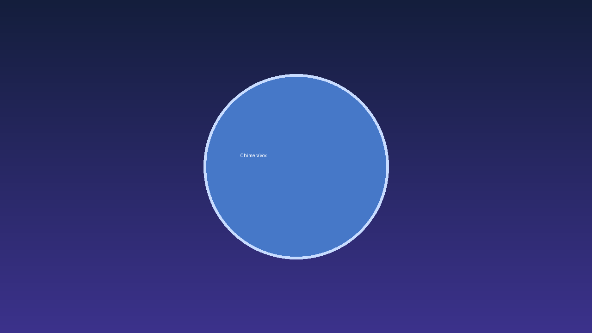

# ChimeraVox

> Forge videos from a single photo and a script — entirely on free tiers.

[](https://github.com/Mourad-Soltani/chimera-vox/actions/workflows/ci.yml)


**Author:** Mourad Soltani (@Mourad-Soltani)  
**Version:** 0.1.3

ChimeraVox turns a still photo plus a written script into a narrated, AI-animated
video at up to 8K resolution, using only free infrastructure:

- **Hugging Face ZeroGPU Spaces** for image-to-video generation (LTX-2.3 Turbo, CogVideoX-5B, Wan Animate)
- **Microsoft Edge Neural Voices** (via `edge-tts`) for narration — no API key
- **FFmpeg** for stitching, audio muxing, and resolution upscaling
- **Mock provider** for fully offline dry-runs and CI
- **Ken Burns fallback** — if all AI providers fail, you still get a narrated video
- **spaces.toml** — override Space IDs without touching code
- **Failure runbook** — `docs/RUNBOOK.md`


## Live Demo

**Public Gradio demo (temporary share, up to ~1 week):**  
https://9f2df5bd8b7ca7cc03.gradio.live

Default mode is **Ken Burns** (CPU-only pan/zoom + edge-tts) — always produces a video.  
Optional Full AI mode tries ZeroGPU Spaces and falls back to Ken Burns if they fail.

Or run locally:

```bash
pip install -e ".[dev]"
pip install gradio edge-tts
python app.py
# → http://127.0.0.1:7860
```

Sample output (Ken Burns + real edge-tts narration):



<video src="assets/demo_output.mp4" controls width="640"></video>

(Raw file: [assets/demo_output.mp4](assets/demo_output.mp4))

## Quick Start

```bash
# 1. Install
pip install -e ".[dev]"

# 2. (Optional) Hugging Face token for higher ZeroGPU quota
export HF_TOKEN="hf_..."

# 3a. Full run (requires network + working Spaces)
chimera-vox run \
  --photo ./my_photo.jpg \
  --script ./my_script.txt \
  --prompt "cinematic slow pan, warm golden hour light" \
  --resolution 4k \
  --output ./final_4k.mp4

# 3b. Dry-run (no network, uses mock provider — perfect for testing)
chimera-vox run \
  --photo ./my_photo.jpg \
  --script ./my_script.txt \
  --dry-run \
  --resolution 720p \
  --output ./dry_run.mp4
```

## CLI Reference

```
chimera-vox run [OPTIONS]

  --photo PATH          Input photo (JPEG/PNG)
  --script PATH         Script file (.txt or .md)
  --prompt TEXT         Additional visual prompt
  --resolution TEXT     720p | 1080p | 4k | 8k  [default: 1080p]
  --voice TEXT          edge-tts voice  [default: en-US-AriaNeural]
  --fps INTEGER         Frame rate  [default: 24]
  --clip-duration FLOAT Seconds per AI clip  [default: 3.0]
  --providers TEXT      Comma-separated order  [default: ltx,cogvideox,wan]
  --output PATH         Output video path
  --threads INTEGER     FFmpeg threads
  --no-health-check     Skip pre-flight checks
  --dry-run             Use mock provider only (offline)
  --verbose             Debug logging

chimera-vox health       Run health checks and exit
chimera-vox voices       List available edge-tts voices
```

## How It Works

1. **Health check** — FFmpeg, edge-tts, disk, photo, provider reachability
2. **Script parsing** — sentence / paragraph packing to ~clip_duration
3. **TTS** — full narration via edge-tts (free, unlimited)
4. **Clip generation** — last-frame continuity across providers with fallback
5. **Stitching** — FFmpeg concat + audio mux
6. **Upscale / encode** — lanczos to target resolution with aspect-preserving pad

## Free-Tier Reality

- ZeroGPU Spaces have daily quotas and shared queues.
- Native generation is usually 720p–1080p; higher resolutions are FFmpeg upscales.
- Clips are typically 2–6 s. Long scripts → many clips; stitching is local and fast.
- Use `--dry-run` for development and CI.

## Development

```bash
make dev          # install with test deps
make test         # pytest
make lint         # ruff
make health       # health checks
chimera-vox run --dry-run ...   # full offline pipeline test
```

See [EVALUATION.md](EVALUATION.md) for readiness assessment.
See [docs/RUNBOOK.md](docs/RUNBOOK.md) for failure recovery steps.
See [docs/ARCHITECTURE.md](docs/ARCHITECTURE.md) for internal design.  

## License

MIT
